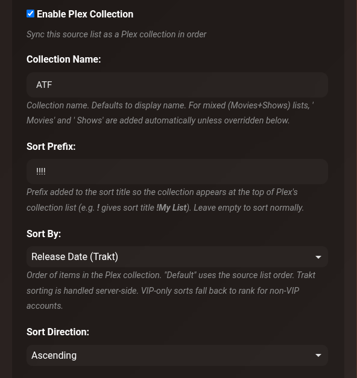
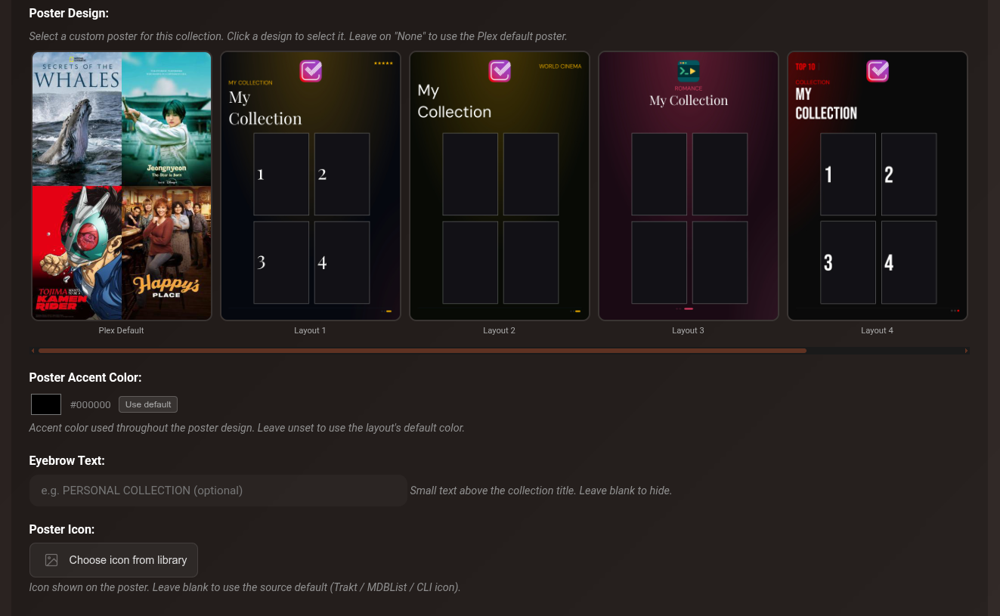
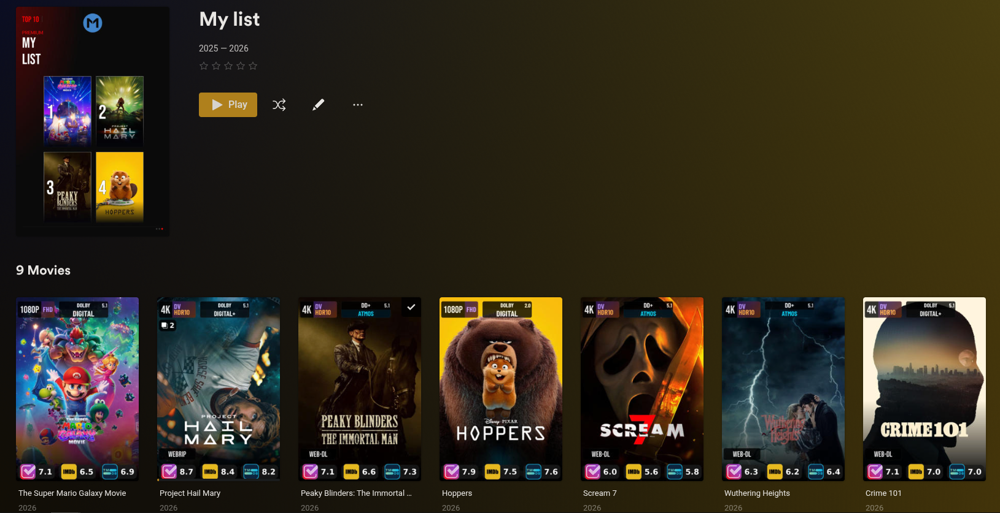

# Plex Collections

CLI Debrid can automatically create and maintain Plex collections that mirror your content source lists — keeping items in the correct sort order and applying a custom designed poster.

!!! warning "Supported sources"
    Plex Collections is only available for [Trakt Lists](../configuration/content-sources.md#trakt-lists), [MDBList](../configuration/content-sources.md#mdblist), and [Adaptive List](../configuration/content-sources.md#adaptive-lists) sources. Other source types (Overseerr, Trakt Watchlist, Plex Watchlist, etc.) do not support this feature.

!!! note "Plex only"
    Plex Collections requires Plex as your media server. The section is hidden in content source settings when using Jellyfin/Emby.

---

## Overview

For [Trakt Lists](../configuration/content-sources.md#trakt-lists), [MDBList](../configuration/content-sources.md#mdblist), and [Adaptive List](../configuration/content-sources.md#adaptive-lists) sources, you can enable a Plex collection that:

- **Stays in sync** — items are added and removed automatically as your list changes
- **Preserves sort order** — collection order mirrors your source list sort (popularity, rating, etc.)
- **Supports custom posters** — choose from 5 designed layouts with your accent colour, eyebrow text, and icon
- **Handles mixed lists** — sources with both movies and shows create separate collections automatically

---

## Setup

In **Settings → Content Sources**, expand any supported source and scroll to the **Plex Collection** section.

| Setting | Description |
|---|---|
| **Enable Plex Collection** | Turns the collection sync on/off for this source |
| **Collection Name** | The Plex collection title. Defaults to the source display name |
| **Movies Collection Name Override** | For mixed lists — override the auto-suffix "Movies" name |
| **Shows Collection Name Override** | For mixed lists — override the auto-suffix "Shows" name |
| **Sort Prefix** | Prefix added to the sort title so the collection floats to the top of Plex's list (e.g. `!!!!` gives sort title `!!!!My List`). Leave empty to sort normally |
| **Sort By** | Order of items in the Plex collection. Options: Default (source list order), Title, Year, Release Date, Collected At, Runtime, **Random** |
| **Sort Direction** | Ascending or Descending |

!!! tip "Mixed lists"
    A Trakt or MDBList source containing both movies and shows automatically creates two collections — one for each type — with " Movies" and " Shows" appended to the name unless you override them.

---

## Poster Design

Scroll to the **Poster Design** section within Plex Collection settings to configure a custom poster.

### Layouts

Choose from 5 layouts. Leave on **Plex Default** to use Plex's auto-generated composite poster.

| Layout | Style |
|---|---|
| **Layout 1** | Left-aligned title, numbered cards (1–4) |
| **Layout 2** | World Cinema style with globe pill |
| **Layout 3** | Centred title, romance/editorial style |
| **Layout 4** | TOP 10 / Netflix style with large rank numbers |
| **Layout 5** | Premium / 4K style with pill badge |

Each layout shows the first 4 collected items from your list as poster art inside the design. Empty slots show as dark placeholders.

### Poster Accent Color

The accent colour drives the header text, glow, and decorative elements throughout the design. Leave **unset** (click **Use default**) to use each layout's built-in default colour.

| Layout | Default colour |
|---|---|
| Layout 1 | Gold `#E6A800` |
| Layout 2 | Green `#039900` |
| Layout 3 | Pink `#DC3C64` |
| Layout 4 | Red `#FF0000` |
| Layout 5 | Blue `#50B4FF` |

### Eyebrow Text

Small text displayed above the collection title on the poster (e.g. `TRAKT`, `TOP PICKS`, `THIS WEEK`). Leave blank to hide.

### Poster Icon

An icon displayed at the top of the poster. Defaults to the source type icon (Trakt, MDBList, or CLI Debrid). Click **Choose icon from library** to pick any overlay logo. Wide logos (e.g. Netflix, Crave) are automatically scaled to fill the available space while preserving aspect ratio.

### Card Overlay Opacity

Controls the darkness of the gradient fade at the bottom of each movie/show card inside the poster. Range: 0–100%, default 60%. Lower values show more of the card artwork; higher values darken the card more.

### Accent Glow Opacity

Controls how bright the accent color glow appears around the edges of the poster background. Range: 0–100%, default 80%. Set to 0 for a purely dark background.

### Accent Glow Radius

Controls how far the accent color spreads across the poster background. Range: 10–200, default 55 (equivalent to radius 0.55). Higher values push the accent color further across the poster — useful for making the color more prominent.

---

## How it works

When a source runs, CLI Debrid:

1. Fetches the source list (Trakt, MDBList, etc.)
2. Matches list items against your Collected library items
3. Creates the Plex collection if it doesn't exist
4. Adds/removes items to match the current list
5. Reorders items to match the desired sort order
6. Generates and uploads the custom poster (if a layout is selected)

Subsequent runs skip unchanged items for efficiency. The poster is only re-rendered when the design, accent colour, eyebrow, icon, collection name, or first 4 items change.

!!! info "Poster updates"
    Changing any poster setting (design, colour, eyebrow, icon) automatically triggers a re-render on the next source run — no manual action needed.

---

## Plex Default poster

Select **Plex Default** (the first option) to remove the custom poster and let Plex display its auto-generated composite artwork.

---

## In Plex

Collections appear in your Plex library under **Collections**. The sort prefix (e.g. `!!!!`) pushes them to the top of the list alphabetically. Items inside the collection maintain the order defined by your sort settings.

---

## Troubleshooting

**Collection not created**

- Verify at least one item from the source list is in `Collected` state in your library
- Check that Plex credentials (URL and token) are configured correctly under **Settings → Plex**

**Items out of order**

- For large collections (100+ items) the initial sort takes several minutes — subsequent syncs are faster as only changed items are moved
- If sort order was changed, trigger the source manually to force a full reorder

**Custom poster not showing in Plex**

- Plex may briefly show the previous poster while processing — wait 10–15 seconds and refresh
- The overlay cleanup task (runs daily) removes old uploaded poster versions from Plex automatically

**Wrong collection name in Plex**

- If you rename the collection via the **Collection Name** field, the Plex collection title updates automatically on the next sync
